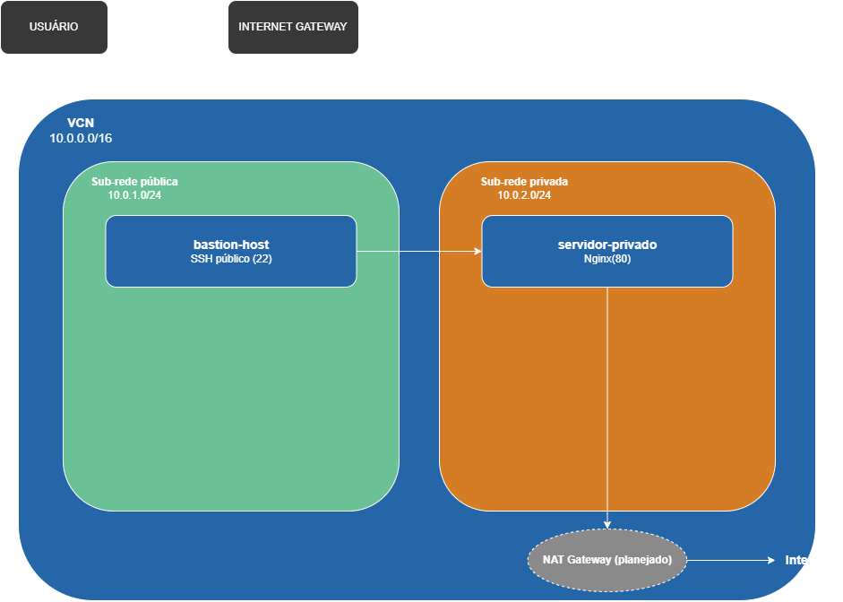

# Homelab de Infraestrutura na Nuvem (Oracle Cloud)

Projeto de infraestrutura e redes construído na Oracle Cloud Infrastructure (OCI), simulando um ambiente corporativo pequeno com segmentação de rede, acesso remoto seguro via bastion host, e monitoramento de disponibilidade.

Projeto desenvolvido como parte do meu portfólio para vagas de infraestrutura e redes de computadores.

## Arquitetura



A rede foi desenhada com o princípio de **defesa em profundidade**: nenhum servidor de aplicação fica diretamente exposto à internet. Todo acesso passa por um único ponto de entrada controlado (o bastion host).

```
Você (SSH) → Internet Gateway → Bastion Host (sub-rede pública)
                                       │
                                       │ SSH jump (agent forwarding)
                                       ▼
                              Servidor Privado + Nginx (sub-rede privada)
```

## Componentes

| Componente | Função |
|---|---|
| **VCN** (`10.0.0.0/16`) | Rede virtual que contém toda a infraestrutura |
| **Sub-rede pública** (`10.0.1.0/24`) | Hospeda o bastion host, único recurso com IP público |
| **Sub-rede privada** (`10.0.2.0/24`) | Hospeda o servidor de aplicação, sem IP público |
| **Internet Gateway** | Permite tráfego de entrada/saída para a sub-rede pública |
| **Security Lists** | Firewall da nuvem — regras de entrada restritas por origem e porta |
| **bastion-host** | VM Ubuntu (Ampere/AMD, Always Free) — porta de entrada SSH |
| **servidor-privado** | VM Ubuntu rodando Nginx, isolada da internet |
| **Uptime Kuma** | Monitoramento de disponibilidade (Docker), rodando no bastion |

## Tecnologias utilizadas

- **Oracle Cloud Infrastructure (OCI)** — VCN, sub-redes, Security Lists, Compute Instances
- **Ubuntu Server 20.04 LTS**
- **Nginx** — servidor web
- **Docker** — containerização do serviço de monitoramento
- **Uptime Kuma** — dashboard de disponibilidade
- **SSH** (chaves ed25519, agent forwarding) — acesso remoto seguro
- **iptables** — firewall a nível de sistema operacional

## Decisões técnicas

- **Bastion host em vez de acesso direto**: o servidor de aplicação nunca recebe IP público. Todo acesso administrativo passa por uma única VM de entrada, com regras de firewall restritas ao meu IP específico (`/32`).
- **SSH Agent Forwarding em vez de copiar a chave privada**: a chave privada nunca sai do meu computador. O bastion "empresta" a autenticação temporariamente para o salto até o servidor privado, sem armazenar nenhuma credencial sensível na nuvem.
- **Sub-redes segmentadas**: pública e privada são isoladas por design — mesmo que a sub-rede pública fosse comprometida, a privada continua inacessível sem passar pelas regras de firewall específicas que liberam apenas o tráfego necessário entre elas.
- **Regras de firewall granulares**: cada porta liberada tem uma justificativa e uma origem restrita (SSH só do meu IP; HTTP/HTTPS liberados publicamente; tráfego interno entre sub-redes liberado apenas nas portas específicas necessárias).

## Desafios e soluções

Esta seção documenta problemas reais enfrentados durante a construção do projeto — não apenas os passos que funcionaram de primeira.

**1. IP público dinâmico quebrando o acesso SSH**
Como minha conexão residencial troca de IP periodicamente, as regras de firewall restritas a `/32` paravam de funcionar sem aviso. Resolvido monitorando o IP atual e atualizando a Security List manualmente. Em um ambiente de produção, isso seria resolvido com uma VPN de IP fixo (ver "Próximos passos").

**2. Limite de gateways na conta trial**
Ao tentar criar um NAT Gateway (necessário para a sub-rede privada acessar a internet para atualizações), esbarrei no limite de "1 gateway por VCN" da conta trial da Oracle. Como alternativa, contornei o problema baixando os pacotes necessários (`.deb`) através do bastion host (que tem acesso à internet) e transferindo via `scp` para o servidor privado, instalando localmente com `apt install ./*.deb`. Essa é uma técnica real usada em ambientes air-gapped ou com conectividade restrita.

**3. Firewall interno (iptables) bloqueando a porta 80**
Mesmo com a Security List da Oracle e o `ufw` liberando a porta 80, as requisições HTTP para o Nginx continuavam falhando com "No route to host". Investigando camada por camada, descobri que as imagens Ubuntu da Oracle vêm com regras de `iptables` pré-configuradas liberando apenas a porta 22 por padrão. Resolvido inserindo uma regra explícita de ACCEPT para a porta 80 antes da regra de REJECT geral, e tornando a mudança permanente com `iptables-persistent`.

**4. Isolamento de rede em containers Docker**
Ao configurar o monitor de SSH no Uptime Kuma (que roda em um container Docker no bastion), usar `localhost` como alvo falhava — o container tem sua própria rede isolada e "localhost" se referia a si mesmo, não à VM hospedeira. Resolvido usando o IP interno real da VM (`10.0.1.216`) em vez de `localhost`.

## Próximos passos

- **Implementar o NAT Gateway** corretamente, assim que o limite de gateways da conta for resolvido (upgrade para Pay As You Go, ainda em processamento no momento da escrita).
- **VPN (WireGuard)** para eliminar a dependência de atualizar manualmente o firewall a cada troca de IP residencial.
- **Automatizar a infraestrutura com Terraform**, tornando toda a criação de VCN, sub-redes e instâncias reproduzível via código.
- **Segunda instância do Uptime Kuma** dentro da sub-rede privada, para monitoramento mais completo sem depender de regras de firewall adicionais entre sub-redes.

## Screenshots

Capturas de tela do ambiente funcionando estão disponíveis na pasta [`screenshots/`](./screenshots).
